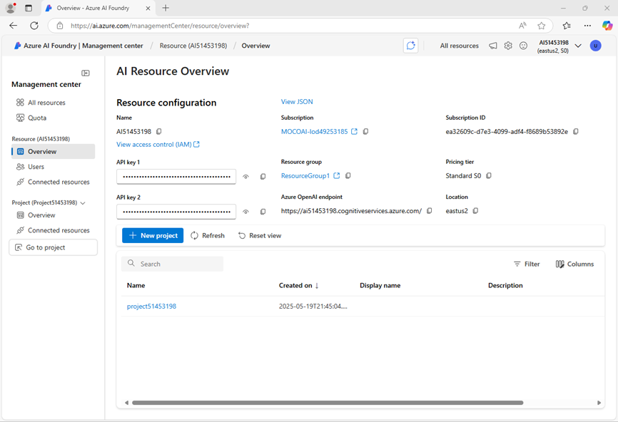
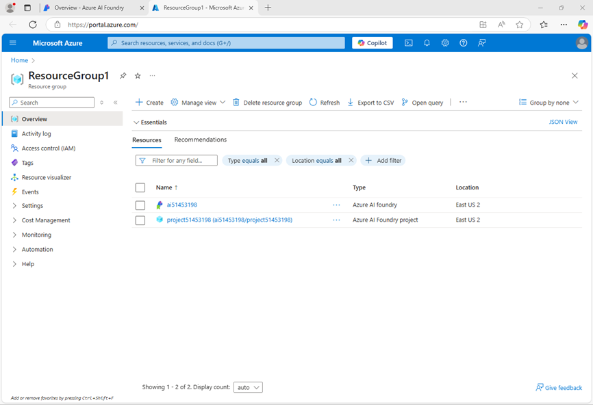
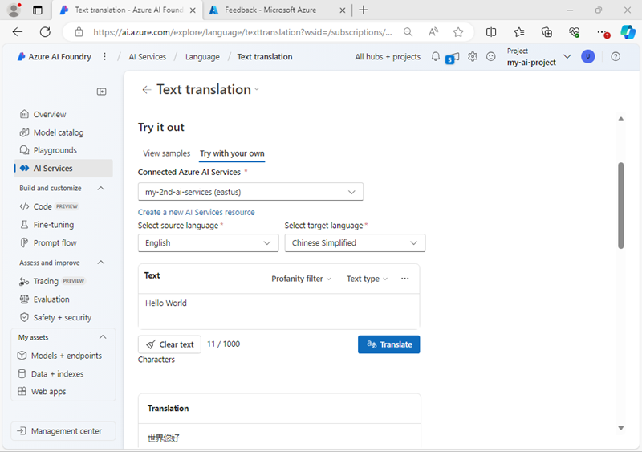

---
lab:
  title: Preparar-se para um projeto de desenvolvimento de IA
  description: Aprenda a organizar recursos de nuvem em hubs e projetos para que os desenvolvedores estejam preparados para o sucesso ao criar soluções de IA.
---

# Preparar-se para um projeto de desenvolvimento de IA

Neste exercício, você usa o portal da Fábrica de IA do Azure para criar um hub e um projeto, prontos para uma equipe de desenvolvedores criar uma solução de IA.

Este exercício levará aproximadamente **30** minutos.

> **Observação**: algumas das tecnologias usadas neste exercício estão em versão prévia ou em desenvolvimento ativo. Você pode observar algum comportamento, avisos ou erros inesperados.

## Abra o portal do Azure AI Foundry

Vamos começar entrando no portal da Fábrica de IA do Azure.

1. Em um navegador da Web, abra o [Portal da Fábrica de IA do Azure](https://ai.azure.com) em `https://ai.azure.com` e entre usando suas credenciais do Azure. Feche quaisquer dicas ou painéis de início rápido que sejam abertos na primeira vez que você fizer login e, se necessário, use o logotipo **Fábrica de IA do Azure** no canto superior esquerdo para navegar até a página inicial, que se parece com a imagem a seguir (feche o painel **Ajuda** se estiver aberto):

    

1. Revise as informações na home page.

## Criar um hub e projeto

Um *hub* de IA do Azure fornece um espaço de trabalho colaborativo no qual você pode definir um ou mais *projetos*. Vamos criar um projeto e um hub de IA do Azure e examinar os recursos do Azure criados para dar suporte a eles.

1. Na home page, selecione **+Criar projeto**.
1. No assistente **Criar um projeto**, insira um nome de projeto adequado e, se um hub existente for sugerido, escolha a opção de criar um novo. Em seguida, examine os recursos do Azure que serão criados automaticamente para dar suporte ao hub e ao projeto.
1. Selecione **Personalizar** e especifique as seguintes configurações para o hub:
    - **Nome do hub**: *um nome para o hub*
    - **Assinatura**: *sua assinatura do Azure*
    - **Grupo de recursos**: *criar ou selecionar um grupo de recursos*
    - **Localização**: selecione **Ajude-me a escolher** e então selecione **gpt-4** na janela do auxiliar de localização e use a região recomendada \*
    - **Conectar os Serviços de IA do Azure ou o OpenAI do Azure** – *Criar um novo recurso de Serviços de IA*
    - **Conectar-se à Pesquisa de IA do Azure**: Ignorar a conexão

    > Os recursos \* da OpenAI do Azure são restritos por cotas regionais. No caso de um limite de cota ser atingido mais adiante no exercício, há a possibilidade de você precisar criar outro recurso em uma região diferente.

1. Clique em **Avançar** e revise a configuração. Em seguida, selecione **Criar** e aguarde a conclusão do processo.
1. Quando o projeto for criado, feche todas as dicas exibidas e examine a página do projeto no Portal da Fábrica de IA do Azure, que deve ser semelhante à imagem a seguir:

    

1. Na parte inferior do painel de navegação à esquerda, selecione **Centro de gerenciamento**. O centro de gerenciamento é onde você pode configurar as configurações nos níveis *hub* e *projeto*; ambos mostrados no painel de navegação.

    

    Observe que no painel de navegação, você pode visualizar e gerenciar ativos de nível de hub e projeto nas seguintes páginas:

    - Visão geral
    - Usuários
    - Modelos e pontos de extremidade
    - Recursos conectados
    - Computação (*somente no nível do hub*)

    > **Observação**: dependendo das permissões atribuídas ao seu Entra ID no seu locatário do Azure, talvez você não consiga gerenciar recursos no nível do hub.

1. No painel de navegação, na seção do seu hub, selecione a página **Visão geral** para visualizar detalhes do seu hub. 
1. No painel **Propriedades do hub**, selecione o link para o grupo de recursos associado ao hub para abrir uma nova guia do navegador e navegar até o portal do Azure. Entre com suas credenciais do Azure, se solicitado.
1. Veja o grupo de recursos no portal do Azure para ver os recursos do Azure que foram criados para dar suporte ao seu hub e projeto.

    

    Observe que os recursos foram criados na região que você selecionou ao criar o hub.

## Adicionar um recurso conectado

Suponha que seu projeto precise de acesso a um segundo recurso dos **Serviços de IA do Azure** em uma região diferente.

1. No portal do Azure, na página do seu grupo de recursos, selecione **+ Criar** e pesquise por `Azure AI Services`. Nos resultados, selecione o recurso multisserviço dos **Serviços de IA do Azure** conforme mostrado na imagem a seguir:

    

1. Crie um novo recurso **Serviços de IA do Azure** com as seguintes configurações:
    - **Assinatura**: *sua assinatura do Azure*
    - **Grupo de recursos**: *o grupo de recursos que contém seus recursos existentes da Fábrica de IA do Azure*
    - **Região**: *selecione qualquer região disponível diferente daquela que contém seus recursos existentes*
    - **Nome**: *um nome adequado para o segundo recurso dos Serviços de IA do Azure*
    - **Tipo de preço**: Standard S0
1. Aguarde a criação do recurso Serviços de AI.
1. Retorne à guia do navegador do Portal da Fábrica de IA do Azure e, na exibição **Centro de gerenciamento**, no painel de navegação, na seção do seu *<u>projeto</u>*, visualize a página **Recursos conectados**. Os recursos conectados existentes em seu projeto são listados.

    

1. Selecione **+ Nova conexão** e selecione o tipo de recurso **Serviços de IA do Azure**. Em seguida, navegue pelos recursos disponíveis para encontrar o recurso Serviços de IA que você criou no portal do Azure e use o botão **Adicionar conexão** para adicioná-lo ao seu projeto.

    

1. Quando o novo recurso estiver conectado, feche a caixa de diálogo **Conectar recursos de serviços de IA do Azure** e verifique se os novos recursos conectados para Serviços de IA do Azure e Serviço OpenAI do Azure estão listados.

## Explorar serviços de IA

Seu projeto da Fábrica de IA do Azure tem acesso aos Serviços de IA do Azure. Vamos tentar isso no portal.

1. Na página Central de gerenciamento, no painel de navegação, em seu projeto, selecione **Ir para o projeto**.
1. No painel de navegação do seu projeto, selecione **Serviços de IA** e selecione o bloco **Idioma e Tradutor**.

    

1. Na seção **Explorar recursos de idioma**, visualize a guia **Tradução** e selecione **Tradução de texto**.

    

1. Na página **Tradução de texto**, na seção **Experimente**, visualize a guia **Experimente você mesmo**.
1. Selecione um dos seus recursos de Serviços de IA do Azure e tente traduzir algum texto (por exemplo, `Hello world`) de um idioma para outro.

    

## Implantar e testar um modelo de IA generativa

Seu projeto também contém recursos conectados para o OpenAI do Azure, o que permite que você use modelos de linguagem do OpenAI do Azure para implementar soluções de IA generativa. Você também pode encontrar e usar modelos de IA generativa de outros fornecedores no catálogo de modelos.

1. No painel à esquerda do seu projeto, na seção **Meus ativos**, selecione a página **Modelos + pontos de extremidade**.
1. Na página **Modelos + pontos extremidades**, na guia **Implantações de modelo**, no menu **+ Implantar modelo**, selecione **Implantar modelo base**.
1. Procure o modelo **gpt-4** na lista, selecione-o e confirme-o.
1. Crie uma nova implantação do modelo com as seguintes configurações selecionando **Personalizar** nos detalhes de implantação:
    - **Nome da implantação**: *um nome válido para sua implantação de modelo*
    - **Tipo de implantação**: padrão global
    - **Atualização automática de versão**: Ativado
    - **Versão do modelo**: *selecione a versão mais recente disponivel*
    - **Recurso de IA conectado**: *selecione a sua conexão de recursos do OpenAI do Azure*
    - **Limite de taxa de tokens por minuto (milhares):** 50 mil *(ou o máximo disponível em sua assinatura, se inferior a 50 mil)*
    - **Filtro de conteúdo**: DefaultV2

    > **Observação**: A redução do TPM ajuda a evitar o uso excessivo da cota disponível na assinatura que você está usando. 50.000 TPM são suficientes para os dados usados neste exercício. Se a sua cota disponível for menor do que isso, você poderá concluir o exercício, mas poderá ocorrer erros se o limite de taxa for excedido.

1. Aguarde até que a implantação seja concluída.

1. Após a implantação do modelo, na página de visão geral da implantação, selecione **Abrir no playground**.
1. Na página **Chat playground**, certifique-se de que a implantação do seu modelo esteja selecionada na seção **Implantação**.
1. No painel **Configuração**, na caixa **Dê instruções e contexto ao modelo**, digite as seguintes instruções:

    ```
    You are a history teacher who can answer questions about past events all around the world.
    ```

1. Aplique as alterações para atualizar a mensagem do sistema.
1. Na janela de chat, insira uma consulta como `What are the key events in the history of Scotland?` e visualize a resposta:

    

## Resumo

Neste exercício, você explorou a Fábrica de IA do Azure e viu como criar e gerenciar hubs e projetos, adicionar recursos conectados e explorar os serviços de IA do Azure e os modelos do OpenAI do Azure no portal da Fábrica de IA do Azure.

## Limpar

Se tiver terminado de explorar o portal do Azure AI Foundry, deverá excluir os recursos que criou neste exercício para evitar incorrer em custos desnecessários do Azure.

1. Retorne à guia do navegador que contém o portal do Azure (ou reabra o [portal do Azure](https://portal.azure.com) em `https://portal.azure.com` em uma nova guia do navegador) e visualize o conteúdo do grupo de recursos onde você implantou os recursos usados neste exercício.
1. Na barra de ferramentas, selecione **Excluir grupo de recursos**.
1. Insira o nome do grupo de recursos e confirme que deseja excluí-lo.
