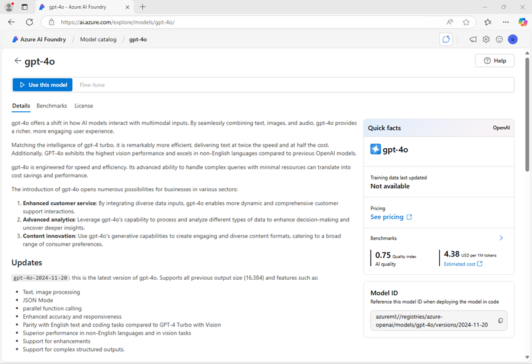
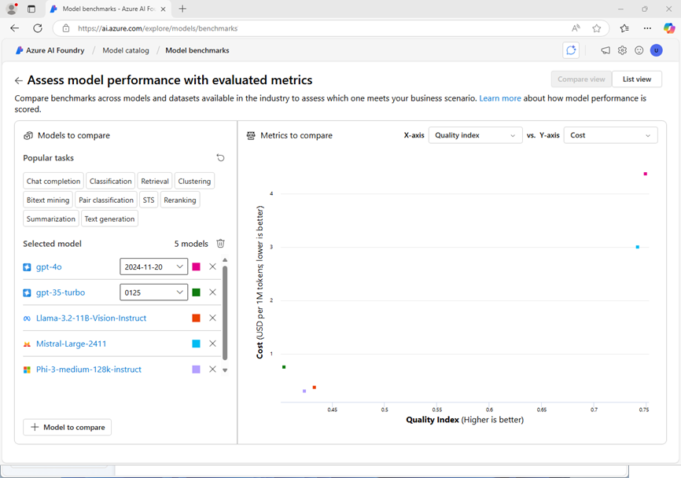

---
lab:
  title: Escolher e implantar um modelo de linguagem
  description: Os aplicativos de IA generativa são criados em um ou mais modelos de linguagem. Saiba como encontrar e selecionar modelos apropriados para seu projeto de IA generativa.
---

# Escolher e implantar um modelo de linguagem

O catálogo de modelos do Azure IA Foundry serve como um repositório central onde você pode explorar e usar uma variedade de modelos, facilitando a criação do cenário de IA generativa.

Neste exercício, você explorará o catálogo de modelos no portal da Fábrica de IA do Azure e comparará modelos potenciais para um aplicativo de IA generativa que auxilia na solução de problemas.

Este exercício levará aproximadamente **25** minutos.

> **Observação**: algumas das tecnologias usadas neste exercício estão em versão prévia ou em desenvolvimento ativo. Você pode observar algum comportamento, avisos ou erros inesperados.

## Explorar modelos

Vamos começar entrando no portal da Fábrica de IA do Azure e explorando alguns dos modelos disponíveis.

1. Em um navegador da Web, abra o [Portal da Fábrica de IA do Azure](https://ai.azure.com) em `https://ai.azure.com` e entre usando suas credenciais do Azure. Feche todas as dicas ou painéis de início rápido abertos na primeira vez que você entrar e, se necessário, use o logotipo da **Fábrica de IA do Azure** no canto superior esquerdo para navegar até a home page, que é semelhante à imagem a seguir (feche o painel **Ajuda** se estiver aberto):

    

1. Revise as informações na home page.
1. Na home page, na seção **Explorar modelos e recursos**, pesquise pelo modelo `gpt-4o`, que usaremos em nosso projeto.
1. Nos resultados da pesquisa, clique no modelo **gpt-4o** para ver os detalhes.
1. Leia a descrição e revise as demais informações disponíveis na guia **Detalhes**.

    

1. Na página **gpt-4o**, exiba a guia **Benchmarks** para ver como o modelo se compara em alguns parâmetros de desempenho padrão com outros modelos usados em cenários semelhantes.

    

1. Use a seta de voltar (**&larr;**) ao lado do título da página **gpt-4o** para retornar ao catálogo de modelos.
1. Pesquise por `Phi-4-mini-instruct` e visualize os detalhes e parâmetros de comparação do modelo **Phi-4-mini-instruct**.

## Comparar modelos

Você analisou dois modelos diferentes, ambos os quais poderiam ser usados para implementar um aplicativo de chat de IA generativa. Agora vamos comparar as métricas desses dois modelos visualmente.

1. Use a seta de voltar (**&larr;**) para retornar ao catálogo de modelos.
1. Selecione **Comparar modelos**. Um gráfico visual para comparação de modelos é exibido com uma seleção de modelos comuns.

    

1. No painel **Modelos a serem comparados**, você pode selecionar tarefas populares, como *respostas às perguntas*, para selecionar automaticamente modelos comumente usados para tarefas específicas.
1. Use o ícone **Limpar todos os modelos** (&#128465;) para remover todos os modelos pré-selecionados.
1. Use o botão **+ Modelo a ser comparado** para adicionar o modelo **gpt-4o** à lista. Em seguida, use o mesmo botão para adicionar o modelo **Phi-4-mini-instruct** à lista.
1. Examine o gráfico, que compara os modelos com base no **Índice de qualidade** (uma pontuação padronizada que indica a qualidade do modelo) e no **Custo**. Você pode ver os valores específicos de um modelo mantendo o mouse sobre o ponto que o representa no gráfico.

    

1. No menu suspenso **Eixo X**, em **Qualidade**, selecione as seguintes métricas e observe cada gráfico resultante antes de passar para o próximo:
    - Precisão
    - Índice de qualidade

    Com base nos parâmetros de comparação, o modelo gpt-4o parece oferecer o melhor desempenho geral, mas a um custo mais alto.

1. Na lista de modelos a serem comparados, selecione o modelo **gpt-4o** para reabrir a página de parâmetros de comparação.
1. Na página do modelo **gpt-4o**, clique na guia **Visão geral** para exibir os detalhes do modelo.

## Criar um projeto do Azure AI Foundry

Para usar um modelo, você precisa criar um *projeto* da Fábrica de IA do Azure.

1. Na parte superior da página de visão geral do modelo **gpt-4o**, clique em **Usar este modelo**.
1. Quando solicitado a criar um projeto, insira um nome válido para o projeto e expanda **Opções avançadas**.
1. Na seção **Opções avançadas**, especifique as seguintes configurações para o projeto:
    - **Recurso da Fábrica de IA do Azure**: *um nome válido para o recurso da Fábrica de IA do Azure*
    - **Assinatura**: *sua assinatura do Azure*
    - **Grupo de recursos**: *criar ou selecionar um grupo de recursos*
    - **Região**: *Selecione qualquer **Local compatível com os Serviços de IA***\*

    > \* Alguns recursos da IA do Azure são restritos por cotas de modelo regional. Caso um limite de cota seja excedido posteriormente no exercício, é possível que você precise criar outro recurso em uma região diferente.

1. Clique em **Criar** e aguarde a criação do projeto, incluindo a implantação do modelo gpt-4 selecionado.
1. Quando o projeto for criado, o playground de chat abrirá automaticamente para que você possa testar o modelo:

    

## Converse com o modelo *gpt-4o*

Agora que você tem uma implantação de modelo, pode usar o playground para testá-la.

1. No playground de chat, no painel **Configuração**, confirme se o modelo **gpt-4o** está selecionado e, no campo **Fornecer instruções e contexto ao modelo**, defina o prompt do sistema como `You are an AI assistant that helps solve problems.`.
1. Clique em **Aplicar alterações** para atualizar o prompt do sistema.

1. Na janela de chat, insira a seguinte consulta

    ```
   I have a fox, a chicken, and a bag of grain that I need to take over a river in a boat. I can only take one thing at a time. If I leave the chicken and the grain unattended, the chicken will eat the grain. If I leave the fox and the chicken unattended, the fox will eat the chicken. How can I get all three things across the river without anything being eaten?
    ```

1. Exiba a resposta. Depois, insira a consulta de acompanhamento a seguir:

    ```
   Explain your reasoning.
    ```

## Implantar outro modelo

Quando você criou o projeto, o modelo **gpt-4o** selecionado foi implantado automaticamente. Vamos implantar o modelo ***Phi-4-mini-instruct** que você também considerou.

1. Na barra de navegação à esquerda, na seção **Meus ativos**, selecione **Modelos + pontos de extremidade**.
1. Na guia **Implantações de modelo**, na lista suspensa **+ Implantar modelo**, selecione **Implantar modelo base**. Pesquise por `Phi-4-mini-instruct` e confirme a selação.
1. Concorde com a licença do modelo.
1. Implante um modelo **Phi-4-mini-instruct** com as seguintes configurações:
    - **Nome da implantação**: *Um nome válido para a implantação de modelo*
    - **Tipo de implantação**: padrão global
    - **Detalhes da implantação**: *use as configurações padrão*

1. Aguarde até que a implantação seja concluída.

## Converse com o modelo *Phi-4*

Agora, vamos conversar com o novo modelo no playground.

1. Na barra de navegação, selecione **Playgrounds**. Depois, selecione o **Playground Chat**.
1. No playground de chat, no painel **Configuração**, verifique se o modelo **Phi-4-mini-instruct** está selecionado e, na caixa de chat, forneça a primeira linha como`System message: You are an AI assistant that helps solve problems.` (ao mesmo prompt do sistema que você usou para testar o modelo gpt-4o, mas como não há uma mensagem de sistema configurada, estamos fornecendo-a na primeira mensagem do chat para dar contexto.)
1. Em uma nova linha na janela de chat (abaixo da mensagem do sistema), insira a consulta a seguir

    ```
   I have a fox, a chicken, and a bag of grain that I need to take over a river in a boat. I can only take one thing at a time. If I leave the chicken and the grain unattended, the chicken will eat the grain. If I leave the fox and the chicken unattended, the fox will eat the chicken. How can I get all three things across the river without anything being eaten?
    ```

1. Exiba a resposta. Depois, insira a consulta de acompanhamento a seguir:

    ```
   Explain your reasoning.
    ```

## Faça uma comparação adicional

1. Use a lista suspensa no painel **Configuração** para alternar entre os modelos, testando ambos os modelos com o seguinte quebra-cabeça (a resposta correta é 40!):

    ```
   I have 53 socks in my drawer: 21 identical blue, 15 identical black and 17 identical red. The lights are out, and it is completely dark. How many socks must I take out to make 100 percent certain I have at least one pair of black socks?
    ```

## Reflita sobre os modelos

Você comparou dois modelos, que podem variar em termos de capacidade de gerar respostas apropriadas e de custo. Em qualquer cenário generativo, você precisa encontrar um modelo com o equilíbrio certo de adequação para a tarefa que você precisa executar e o custo de usar o modelo para o número de solicitações que você espera que ele tenha que processar.

Os detalhes e parâmetros fornecidos no catálogo de modelos, além da capacidade de comparar modelos visualmente, fornecem um ponto de partida útil ao identificar modelos candidatos para uma solução de IA generativa. Em seguida, você pode testar modelos candidatos com uma variedade de prompts de sistema e usuário no playground de chat.

## Limpar

Se tiver terminado de explorar o portal do Azure AI Foundry, deverá excluir os recursos que criou neste exercício para evitar incorrer em custos desnecessários do Azure.

1. Abra o [portal do Azure](https://portal.azure.com) e exiba o conteúdo do grupo de recursos em que você implantou os recursos usados neste exercício.
1. Na barra de ferramentas, selecione **Excluir grupo de recursos**.
1. Insira o nome do grupo de recursos e confirme que deseja excluí-lo.
