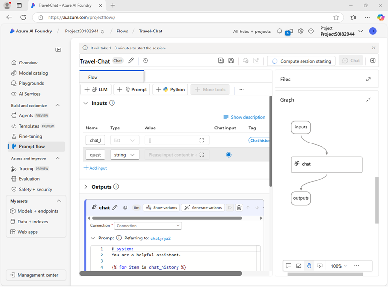

---
lab:
  title: Usar um prompt flow para gerenciar conversas em um aplicativo de chat
  description: Saiba como usar prompt flows para gerenciar diálogos de conversa e garantir que os prompts sejam construídos e orquestrados para obter melhores resultados.
---

## Usar um prompt flow para gerenciar conversas em um aplicativo de chat

Neste exercício, você usará o prompt flow do portal da Fábrica de IA do Azure para criar um aplicativo de chat personalizado que usa um prompt de usuário e um histórico de chat como entradas e usa um modelo GPT do OpenAI do Azure para gerar uma saída.

Este exercício levará aproximadamente **30** minutos.

> **Observação**: algumas das tecnologias usadas neste exercício estão em versão prévia ou em desenvolvimento ativo. Você pode observar algum comportamento, avisos ou erros inesperados.

## Crie um hub e projeto da Fábrica de IA do Azure

Os recursos da Fábrica de IA do Azure que usaremos neste exercício requerem um projeto baseado em um recurso de *hub* da Fábrica de IA do Azure.

1. Em um navegador da Web, abra o [Portal da Fábrica de IA do Azure](https://ai.azure.com) em `https://ai.azure.com` e entre usando suas credenciais do Azure. Feche todas as dicas ou painéis de início rápido abertos na primeira vez que você entrar e, se necessário, use o logotipo da **Fábrica de IA do Azure** no canto superior esquerdo para navegar até a home page, que é semelhante à imagem a seguir (feche o painel **Ajuda** se estiver aberto):

    

1. No navegador, navegue até `https://ai.azure.com/managementCenter/allResources` e clique em **Criar**. Em seguida, escolha a opção para criar um novo **Recurso do hub de IA**.
1. No assistente **Criar projeto**, insira um nome válido para o projeto e selecione a opção para criar um novo hub. Em seguida, use o link **Renomear hub** para especificar um nome válido para o novo hub, expanda **Opções avançadas** e especifique as seguintes configurações para o projeto:
    - **Assinatura**: *sua assinatura do Azure*
    - **Grupo de recursos**: *criar ou selecionar um grupo de recursos*
    - **Região**: Leste dos EUA 2 ou Suécia Central (*Caso um limite de cota seja excedido posteriormente no exercício, talvez você precise criar outro recurso em uma região diferente.*)

    > **Observação**: se você estiver trabalhando em uma assinatura do Azure na qual as políticas são usadas para restringir nomes de recursos permitidos, talvez seja necessário usar o link na parte inferior da caixa de diálogo **Criar um novo projeto** para criar o hub usando o portal do Azure.

    > **Dica**: se o botão **Criar** ainda estiver desativado, certifique-se de renomear o hub com um valor alfanumérico exclusivo.

1. Aguarde até que seu projeto seja criado.

## Configurar autorização de recursos

As ferramentas de fluxo de prompt na Fábrica de IA do Azure criam ativos baseados em arquivo que definem o fluxo de prompt em uma pasta no armazenamento de blobs. Antes de explorarmos o fluxo de prompt, vamos garantir que o recurso da Fábrica de IA do Azure tenha o acesso necessário ao repositório de blobs para que ele possa lê-los.

1. Em uma nova guia do navegador, abra o [portal do Azure](https://portal.azure.com) em `https://portal.azure.com`, entrando com as suas credenciais do Azure, se solicitado, e visualize o grupo de recursos que contém os recursos de hub da IA do Azure.
1. Clique no recurso **Fábrica de IA do Azure** do hub para abri-lo. Em seguida, expanda a seção **Gerenciamento de Recuros** e clique na página **Identidade** :

    

1. Se o status da identidade atribuída pelo sistema for **Desativado**,** Ative-o **e salve as alterações. Em seguida, aguarde a confirmação da mudança de status.
1. Retorne à página do grupo de recursos e selecione o recurso **Conta de armazenamento** para seu hub e visualize sua página **IAM (Controle de Acesso)**:

    

1. Adicione uma atribuição de função à função `Storage blob data reader` para a identidade gerenciada usada pelo recurso da Fábrica de IA do Azure:

    

1. Depois de revisar e atribuir o acesso de função para permitir que a identidade gerenciada da Fábrica de IA do Azure leia blobs na conta de armazenamento, feche a guia do portal do Azure e retorne ao portal da Fábrica de IA do Azure.

## Implantar um modelo de IA generativa

Agora você está em condições de implantar um modelo de linguagem de IA generativa para dar suporte ao seu aplicativo de fluxo imediato.

1. No painel à esquerda do seu projeto, na seção **Meus ativos**, selecione a página **Modelos + pontos de extremidade**.
1. Na página **Modelos + pontos extremidades**, na guia **Implantações de modelo**, no menu **+ Implantar modelo**, selecione **Implantar modelo base**.
1. Procure o modelo **gpt-4o** na lista, selecione-o e confirme-o.
1. Crie uma nova implantação do modelo com as seguintes configurações selecionando **Personalizar** nos detalhes de implantação:
    - **Nome da implantação**: *Um nome válido para a implantação de modelo*
    - **Tipo de implantação**: padrão global
    - **Atualização automática de versão**: Ativado
    - **Versão do modelo**: *selecione a versão mais recente disponivel*
    - **Recurso de IA conectado**: *selecione a sua conexão de recursos do OpenAI do Azure*
    - **Limite de taxa de tokens por minuto (milhares):** 50 mil *(ou o máximo disponível em sua assinatura, se inferior a 50 mil)*
    - **Filtro de conteúdo**: DefaultV2

    > **Observação**: A redução do TPM ajuda a evitar o uso excessivo da cota disponível na assinatura que você está usando. 50.000 TPM são suficientes para os dados usados neste exercício. Se a sua cota disponível for menor do que isso, você poderá concluir o exercício, mas poderá ocorrer erros se o limite de taxa for excedido.

1. Aguarde até que a implantação seja concluída.

## Criar um fluxo de prompt

Um fluxo de prompt fornece uma maneira de orquestrar prompts e outras atividades para definir uma interação com um modelo de IA generativa. Neste exercício, você usará um modelo para criar um fluxo de chat básico para um assistente de IA em uma agência de viagens.

1. Na barra de navegação do Portal da Fábrica de IA do Azure, na seção **Criar e personalizar**, selecione **Fluxo de prompt**.
1. Criar um novo fluxo com base no modelo de **Fluxo de chat**, especificando `Travel-Chat` como o nome da pasta.

    Um fluxo de chat simples é criado para você.

    > **Dica**: se ocorrer um erro de permissões, aguarde alguns minutos e tente novamente, especificando um nome de fluxo diferente se necessário.

1. Para poder testar seu fluxo, você precisa de computação e pode demorar um pouco para iniciar, portanto, selecione **Iniciar sessão de computação** para iniciá-la enquanto explora e modifica o fluxo padrão.

1. Visualize o fluxo de prompt, que consiste em uma série de *entradas*, *saídas*, e *ferramentas*. Você pode expandir e editar as propriedades desses objetos nos painéis de edição à esquerda e exibir o fluxo geral como um gráfico à direita:

    

1. Visualize o painel de **Entradas**, e observe que há duas entradas (histórico de chats e a pergunta do usuário)
1. Exiba o painel **Saídas** e observe que há uma saída para refletir a resposta do modelo.
1. Exiba o painel de ferramentas LLM do **Chat**, que contém as informações necessárias para enviar um prompt ao modelo.
1. No painel de ferramentas LLM do **Chat** , para **Conexão**, selecione a conexão para o recurso de Serviço OpenAI do Azure em seu Hub de IA. Em seguida, configure as propriedades a seguir:
    - **Api**: chat
    - **deployment_name**: *o modelo gpt-4o que você implantou*
    - **response_format**: {"type":"text"}
1. Modifique o campo **Prompt** da seguinte maneira:

   ```yml
   # system:
   **Objective**: Assist users with travel-related inquiries, offering tips, advice, and recommendations as a knowledgeable travel agent.

   **Capabilities**:
   - Provide up-to-date travel information, including destinations, accommodations, transportation, and local attractions.
   - Offer personalized travel suggestions based on user preferences, budget, and travel dates.
   - Share tips on packing, safety, and navigating travel disruptions.
   - Help with itinerary planning, including optimal routes and must-see landmarks.
   - Answer common travel questions and provide solutions to potential travel issues.

   **Instructions**:
   1. Engage with the user in a friendly and professional manner, as a travel agent would.
   2. Use available resources to provide accurate and relevant travel information.
   3. Tailor responses to the user's specific travel needs and interests.
   4. Ensure recommendations are practical and consider the user's safety and comfort.
   5. Encourage the user to ask follow-up questions for further assistance.

   
   # user:
   {{item.inputs.question}}
   # assistant:
   {{item.outputs.answer}}
   

   # user:
   {{question}}
   ```

    Leia o prompt que você adicionou para se familiarizar com ele. Consiste em uma mensagem do sistema (que inclui um objetivo, uma definição de seus recursos e algumas instruções) e o histórico de chat (ordenado para mostrar cada entrada de pergunta do usuário e cada saída de resposta do assistente anterior)

1. Na seção **Entradas** para a ferramente LLM de **Chat** (em prompt), verifique se as seguintes variáveis estão definidas:
    - **question** (string): ${inputs.question}
    - **chat_history** (string): ${inputs.chat_history}

1. Salve as alterações ao fluxo.

    > **Observação**: neste exercício, vamos nos ater a um fluxo de chat simples, mas observe que o editor de fluxo de prompt inclui muitas outras ferramentas que você pode adicionar ao fluxo, permitindo que você crie uma lógica complexa para organizar conversas.

## Testar o fluxo

Agora que você desenvolveu o fluxo, você pode usar a janela de chat para testar o fluxo.

1. Certifique-se de que a sessão de computação esteja em execução. Se não estiver, aguarde até iniciar.
1. Na barra de ferramentas, selecione **Chat** para abrir o painel **Chat** e aguarde a inicialização do chat.
1. Insira a consulta: `I have one day in London, what should I do?` e examine a saída. O painel do Chat deve ter uma aparência semelhante a esta:

    

## Implantar o fluxo

Quando estiver satisfeito com o comportamento do fluxo criado, você poderá implantar o fluxo.

> **Observação**: a implantação pode levar muito tempo e pode ser afetada por restrições de capacidade em sua assinatura ou locatário.

1. Na barra de ferramentas, selecione **Implantar** e implemente o fluxo com as seguintes configurações:
    - **Configurações básicas**:
        - **Ponto de extremidade**: Novo
        - **Nome do ponto de extremidade**: *Insira um nome exclusivo*
        - **Nome da implantação**: *Insira um nome exclusivo*
        - **Máquina virtual**: Standard_DS3_v2
        - **Contagem de instâncias**: 1
        - **Coleta de dados de inferência**: desabilitada
    - **Configurações avançadas**:
        - *Usar as configurações padrão*
1. No Portal da Fábrica de IA do Azure, em seu projeto, no painel de navegação à esquerda, em **Meus Ativos**, selecione a página **Modelos + pontos de extremidade**.

    Se a página for aberta para o modelo gpt-4o, use o botão **Voltar** para visualizar todos os modelos e pontos de extremidade.

1. Inicialmente, a página pode mostrar apenas suas implantações de modelo. Pode levar algum tempo até que a implantação seja listada, e ainda mais antes de ser criado com sucesso.
1. Quando a implantação for *bem-sucedida*, selecione-a. Em seguida, exiba sua página de **Teste**.

    > **Dica**: se a página de teste descrever o ponto de extremidade como não íntegro, retorne aos **modelos e pontos de** extremidade e aguarde cerca de um minuto antes de atualizar a exibição e selecionar o ponto de extremidade novamente.

1. Insira o prompt `What is there to do in San Francisco?` e revise a resposta.
1. Insira o prompt `Tell me something about the history of the city.` e revise a resposta.

    O painel de teste deve ter uma aparência semelhante a esta:

    

1. Exiba a página **Consumir** para o ponto de extremidade e observe que ela contém informações de conexão e código de exemplo que você pode usar para compilar um aplicativo cliente para o ponto de extremidade, permitindo que você integre a solução de prompt flow a um aplicativo como uma IA generativa personalizada.

## Limpar

Ao terminar de explorar o fluxo de prompt, você deve excluir os recursos que criou para evitar custos desnecessários do Azure.

- Navegue até o [portal do Azure](https://portal.azure.com) em `https://portal.azure.com`.
- No portal do Azure, na **Página Inicial**, selecione **Grupos de recursos**.
- Selecione o grupo de recursos criado para este exercício.
- Na parte superior da página de **Visão Geral** do grupo de recursos, selecione **Excluir o grupo de recursos**.
- Digite o nome do grupo de recursos para confirmar que deseja excluí-lo e selecione **Excluir**.
