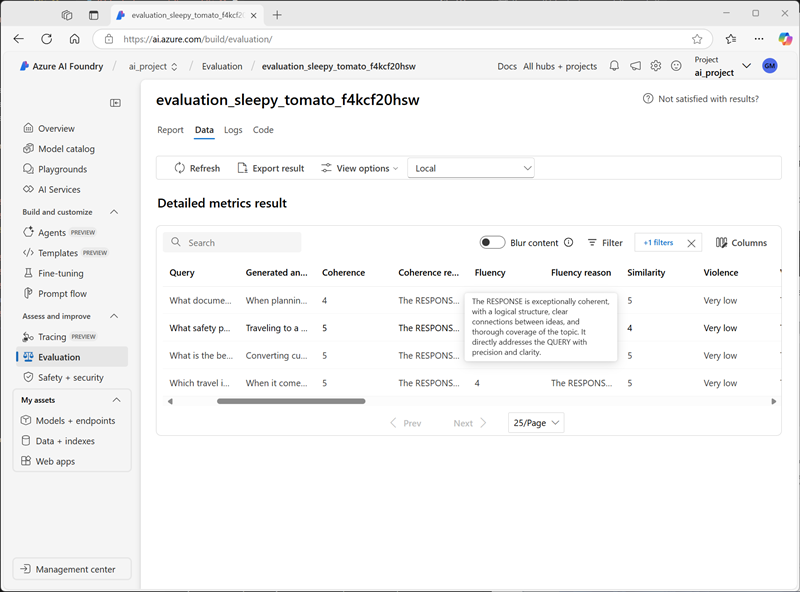

---
lab:
  title: Avaliar o desempenho do modelo da IA generativa
  description: Aprenda a avaliar modelos e prompts para otimizar o desempenho do seu aplicativo de chat e sua capacidade de responder adequadamente.
---

# Avaliar o desempenho do modelo da IA generativa

Neste exercício, você usará avaliações manuais e automatizadas para avaliar o desempenho de um modelo no Portal da Fábrica de IA do Azure.

Este exercício levará aproximadamente **30** minutos.

> **Observação**: algumas das tecnologias usadas neste exercício estão em versão prévia ou em desenvolvimento ativo. Você pode observar algum comportamento, avisos ou erros inesperados.

## Criar um projeto do Azure AI Foundry

Vamos começar criando um projeto da Fábrica de IA do Azure.

1. Em um navegador da Web, abra o [Portal da Fábrica de IA do Azure](https://ai.azure.com) em `https://ai.azure.com` e entre usando suas credenciais do Azure. Feche todas as dicas ou painéis de início rápido abertos na primeira vez que você entrar e, se necessário, use o logotipo da **Fábrica de IA do Azure** no canto superior esquerdo para navegar até a home page, que é semelhante à imagem a seguir (feche o painel **Ajuda** se estiver aberto):

    

1. Na home page, selecione **+Criar projeto**.
1. No assistente **Criar um projeto**, insira um nome de projeto adequado e, se um hub existente for sugerido, escolha a opção de criar um novo. Em seguida, examine os recursos do Azure que serão criados automaticamente para dar suporte ao hub e ao projeto.
1. Selecione **Personalizar** e especifique as seguintes configurações para o hub:
    - **Nome do hub**: *um nome para o hub*
    - **Assinatura**: *sua assinatura do Azure*
    - **Grupo de recursos**: *criar ou selecionar um grupo de recursos*
    - **Local**: selecione uma das seguintes regiões\*
        - Leste dos EUA 2
        - França Central
        - Sul do Reino Unido
        - Suécia Central
    - **Conectar os Serviços de IA do Azure ou o OpenAI do Azure** – *Criar um novo recurso de Serviços de IA*
    - **Conectar-se à Pesquisa de IA do Azure**: Ignorar a conexão

    > \* No momento da redação deste artigo, essas regiões suportam a avaliação das métricas de segurança da IA. A disponibilidade do modelo é limitada por cotas regionais. No caso de um limite de cota ser atingido mais adiante no exercício, há a possibilidade de você precisar criar outro projeto em uma região diferente.

1. Clique em **Avançar** e revise a configuração. Em seguida, selecione **Criar** e aguarde a conclusão do processo.
1. Quando o projeto for criado, feche todas as dicas exibidas e examine a página do projeto no Portal da Fábrica de IA do Azure, que deve ser semelhante à imagem a seguir:

    

## Implantar modelos

Neste exercício, você avaliará o desempenho de um modelo gpt-4o-mini. Você também usará um modelo gpt-4o para gerar métricas de avaliação assistidas por IA.

1. No painel de navegação à esquerda do seu projeto, na seção **Meus ativos**, selecione a página **Modelos + pontos de extremidade**.
1. Na página **Modelos + pontos extremidades**, na guia **Implantações de modelo**, no menu **+ Implantar modelo**, selecione **Implantar modelo base**.
1. Procure o modelo **gpt-4** na lista, selecione-o e confirme-o.
1. Crie uma nova implantação do modelo com as seguintes configurações selecionando **Personalizar** nos detalhes de implantação:
    - **Nome da implantação**: *um nome válido para sua implantação de modelo*
    - **Tipo de implantação**: padrão global
    - **Atualização automática de versão**: Ativado
    - **Versão do modelo**: *selecione a versão mais recente disponivel*
    - **Recurso de IA conectado**: *selecione a sua conexão de recursos do OpenAI do Azure*
    - **Limite de taxa de tokens por minuto (milhares):** 50 mil *(ou o máximo disponível em sua assinatura, se inferior a 50 mil)*
    - **Filtro de conteúdo**: DefaultV2

    > **Observação**: A redução do TPM ajuda a evitar o uso excessivo da cota disponível na assinatura que você está usando. 50.000 TPM são suficientes para os dados usados neste exercício. Se a sua cota disponível for menor do que isso, você poderá concluir o exercício, mas poderá ocorrer erros se o limite de taxa for excedido.

1. Aguarde até que a implantação seja concluída.
1. Retorne à página **Modelos + pontos de extremidade** e repita as etapas anteriores para implantar um modelo **gpt-4o-mini** com as mesmas configurações.

## Avaliar manualmente um modelo

Você pode revisar manualmente as respostas do modelo com base nos dados do teste. A revisão manual permite testar diferentes entradas para avaliar se o modelo está funcionando conforme o esperado.

1. Em uma nova guia do navegador, baixe o [travel_evaluation_data.csv](https://raw.githubusercontent.com/MicrosoftLearning/mslearn-ai-studio/refs/heads/main/data/travel_evaluation_data.csv) de `https://raw.githubusercontent.com/MicrosoftLearning/mslearn-ai-studio/refs/heads/main/data/travel_evaluation_data.csv` e salve-o em uma pasta local.
1. De volta à guia do Portal da Fábrica de IA do Azure, no painel de navegação, na seção **Avaliar e melhorar**, selecione **Avaliação**.
1. Na página **Avaliação**, visualize a guia **Avaliações manuais** e selecione **+ Nova avaliação manual**.
1. Altere a **Mensagem do sistema** para as seguintes instruções de um assistente de viagens de IA:

   ```
   Objective: Assist users with travel-related inquiries, offering tips, advice, and recommendations as a knowledgeable travel agent.

   Capabilities:
   - Provide up-to-date travel information, including destinations, accommodations, transportation, and local attractions.
   - Offer personalized travel suggestions based on user preferences, budget, and travel dates.
   - Share tips on packing, safety, and navigating travel disruptions.
   - Help with itinerary planning, including optimal routes and must-see landmarks.
   - Answer common travel questions and provide solutions to potential travel issues.
    
   Instructions:
   1. Engage with the user in a friendly and professional manner, as a travel agent would.
   2. Use available resources to provide accurate and relevant travel information.
   3. Tailor responses to the user's specific travel needs and interests.
   4. Ensure recommendations are practical and consider the user's safety and comfort.
   5. Encourage the user to ask follow-up questions for further assistance.
   ```

1. Na seção **Configurações**, na lista **Modelo**, selecione sua implantação de modelo **gpt-4o-mini**.
1. Na seção **Resultado de avaliação manual**, selecione **Importar dados de tests** e carregue o arquivo **travel_evaluation_data.csv** que você baixou anteriormente, mapeamndo os campos de conjunto da dos conforme a seguir:
    - **Entrada**: Question
    - **Resposta esperada**: ExpectedResponse
1. Examine as perguntas e as respostas esperadas no arquivo de teste — você as usará para avaliar as respostas geradas pelo modelo.
1. Selecione **Executar** na barra superior para gerar saídas para todas as perguntas que você adicionou como entradas. Após alguns minutos, as respostas do modelo devem ser mostradas em uma nova coluna **Saída**, como esta:

    

1. Revise as saídas de cada pergunta, comparando a saída do modelo com a resposta esperada e "pontuando" os resultados selecionando o ícone de polegar para cima ou para baixo no canto inferior direito de cada resposta.
1. Depois de pontuar as respostas, examine os blocos de resumo acima da lista. Em seguida, na barra de ferramentas, selecione **Salvar resultados** e atribua um nome adequado. Salvar os resultados permite recuperá-los posteriormente para avaliação ou comparação com um modelo diferente.

## Usar avaliações automatizadas

Embora comparar manualmente a saída do modelo com suas próprias respostas esperadas possa ser uma maneira útil de avaliar o desempenho de um modelo, é uma abordagem demorada em cenários em que você espera uma ampla variedade de perguntas e respostas e fornece pouco em termos de métricas padronizadas que você pode usar para comparar diferentes combinações de modelos e prompts.

A avaliação automatizada é uma abordagem que tenta resolver essas deficiências calculando métricas e usando IA para avaliar as respostas quanto à coerência, relevância e outros fatores.

1. Use a seta para trás (**&larr;**) ao lado do título da página **Avaliação manual** para retornar à página **Avaliação**.
1. Exiba a guia **Avaliações automatizadas**.
1. Selecione **Criar uma nova avaliação** e, quando solicitado, selecione a opção para avaliar um **Modelo e prompt**
1. Na página **Criar uma nova avaliação**, na seção **Informações básicas**, revise o nome de avaliação padrão gerado automaticamente (você pode alterá-lo se desejar) e selecione sua implantação de modelo **gpt-40-mini**.
1. Altere a **Mensagem do sistema** para as mesmas instruções de um assistente de viagem de IA que você usou anteriormente:

   ```
   Objective: Assist users with travel-related inquiries, offering tips, advice, and recommendations as a knowledgeable travel agent.

   Capabilities:
   - Provide up-to-date travel information, including destinations, accommodations, transportation, and local attractions.
   - Offer personalized travel suggestions based on user preferences, budget, and travel dates.
   - Share tips on packing, safety, and navigating travel disruptions.
   - Help with itinerary planning, including optimal routes and must-see landmarks.
   - Answer common travel questions and provide solutions to potential travel issues.
    
   Instructions:
   1. Engage with the user in a friendly and professional manner, as a travel agent would.
   2. Use available resources to provide accurate and relevant travel information.
   3. Tailor responses to the user's specific travel needs and interests.
   4. Ensure recommendations are practical and consider the user's safety and comfort.
   5. Encourage the user to ask follow-up questions for further assistance.
   ```

1. Na seção **Configurar dados de teste**, observe que você pode usar um modelo GPT para gerar dados de teste para você (que você pode editar e complementar para corresponder às suas próprias expectativas), usar um conjunto de dados existente ou fazer upload de um arquivo. Neste exercício, selecione **Usar conjunto de dados existente** e, em seguida, selecione o conjunto de dados **travel_evaluation_data_csv_*xxxx...*** (que foi criado quando você carregou o arquivo .csv anteriormente).
1. Examine as linhas de exemplo do conjunto de dados e, na seção **Escolher sua coluna de dados**, selecione os seguintes mapeamentos de coluna:
    - **Consulta**: Question
    - **Contexto**: *deixe isso em branco. Ele é usado para avaliar a "fundamentação" ao associar uma fonte de dados contextual ao seu modelo.*
    - **Verdade básica**: ExpectedAnswer
1. Na seção **Escolha o que gostaria de avaliar**, selecione <u>todas</u> as categorias de avaliação a seguir:
    - Qualidade da IA (assistida por IA)
    - Risco e segurança (assistido por IA)
    - Qualidade da IA (NLP)
1. Na lista **Escolha um modelo de implantação como juiz**, selecione seu modelo **gpt-4o**. Este modelo será usado para avaliar as respostas do modelo ***gpt-4o-mini** quanto à qualidade relacionada à linguagem e métricas de comparação de IA generativa padrão.
1. Selecione **Criar** para iniciar o processo de avaliação e aguardar sua conclusão. Isso pode levar alguns minutos.

    > **Dica**: se um erro indicando que as permissões do projeto estão sendo definidas for cancelado, aguarde um minuto e selecione **Criar** novamente. Pode levar algum tempo para que as permissões de recursos de um projeto recém-criado sejam propagadas.

1. Quando a avaliação for concluída, role para baixo, se necessário, para ver a área do **painel de métrica** e visualizar as métricas de **qualidade da IA**:

    

    Use os ícones **<sup>(i)</sup>** para visualizar as definições de métrica.

1. Exiba a guia **Risco e segurança** para ver as métricas associadas a conteúdo potencialmente prejudicial.
1. Exiba a guia **Qualidade da IA (NLP**) para ver métricas padrão para modelos de IA generativos.
1. Role de volta para a parte superior da página, se necessário, e selecione a guia **Dados** para ver os dados brutos da avaliação. Os dados incluem as métricas para cada entrada, bem como explicações do raciocínio que o modelo gpt-4o aplicou ao avaliar as respostas.

    

## Limpar

Quando terminar de explorar o Azure IA Foundry, exclua os recursos criados para evitar custos desnecessários do Azure.

- Navegue até o [portal do Azure](https://portal.azure.com) em `https://portal.azure.com`.
- No portal do Azure, na **Página Inicial**, selecione **Grupos de recursos**.
- Selecione o grupo de recursos criado para este exercício.
- Na parte superior da página de **Visão Geral** do grupo de recursos, selecione **Excluir o grupo de recursos**.
- Digite o nome do grupo de recursos para confirmar que deseja excluí-lo e selecione **Excluir**.
