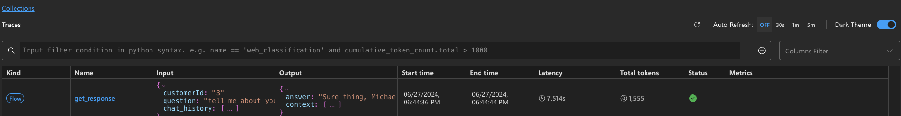

---
lab:
  title: Criar um copiloto personalizado usando ferramentas de desenvolvimento que priorizam o código
---

# Criar um copiloto personalizado usando ferramentas de desenvolvimento que priorizam o código

Neste exercício, você clonará e implantará um modelo do Azure Developer CLI que provisiona e [implanta seu projeto de IA em um ponto de extremidade online](https://learn.microsoft.com/azure/developer/azure-developer-cli/azure-ai-ml-endpoints?WT.mc_id=academic-140829-cacaste) no Estúdio de IA do Azure. Em seguida, você o usará como ponto de partida para criar seu próprio copiloto personalizado com a IA do Azure e uma experiência que prioriza o código.

Este exercício levará aproximadamente **90** minutos.

## Antes de começar

Para concluir este exercício, você precisa de:

- Uma conta do GitHub para bifurcar o repositório do projeto e testá-lo em um ambiente do GitHub Codespaces. Criar uma conta gratuita [no GitHub](https://github.com/).
- A camada básica da Pesquisa de IA do Azure para ativar o Classificador Semântico. Saiba mais sobre os [detalhes de preços da Pesquisa de IA](https://azure.microsoft.com/pricing/details/search/).
- Para implantar três modelos do OpenAI (`gpt-35-turbo`, `gpt-4`, `text-embedding-ada-002`). Para poder implantar os modelos, você precisa criar o hub de IA em uma região com cota suficiente. Saiba mais sobre a [disponibilidade da região de modelos](https://learn.microsoft.com/azure/ai-services/openai/concepts/models?WT.mc_id=academic-140829-cacaste#model-summary-table-and-region-availability)

## Compreender o cenário

Para começar a usar o modelo de projeto de IA do Azure Developer CLI, navegue até a coleção [Modelos de IA do Azure com o Azure Developer CLI](https://learn.microsoft.com/collections/5pq0uompdgje8d/?WT.mc_id=academic-140829-cacaste). Ao explorar a coleção, você pode encontrar vários projetos agrupados por tecnologia e caso de uso, incluindo exemplos de projetos multimodais e multiagentes, projetos semelhantes a copilotos e exemplos que integram diferentes estruturas e serviços do Azure.

Para este exercício, você usará o modelo de projeto **[Contoso Chat Retail com o Estúdio de IA do Azure e PromptFlow (Python)](https://aka.ms/contoso-retail-sample)** como ponto de partida. Esse modelo de projeto é uma experiência que prioriza o código que usa Prompty e PromptFlow para criar um copiloto personalizado (IA de chat) que pode ser integrado ao site de varejo (interface do usuário de chat) de uma empresa fictícia chamada Contoso Outdoors.


A solução de copiloto de varejo usa um padrão de RAG (Geração Aumentada de Recuperação) para fundamentar as respostas nos dados de produtos e clientes da empresa. Os clientes podem fazer perguntas ao chatbot de varejo sobre o catálogo de produtos da empresa e também obter recomendações com base nas compras anteriores deles.

Ao selecionar o link do projeto incluído na coleção, você será redirecionado para o repositório GitHub que hospeda o código do modelo. O arquivo [README.md](https://github.com/Azure-Samples/contoso-chat/blob/main/README.md) no repositório fornece uma descrição detalhada do projeto, incluindo a arquitetura, os pré-requisitos e as etapas para implantar o projeto.


## Configurar GitHub Codespaces

Neste exercício, você usará o [GitHub Codespaces](https://github.com/features/codespaces), um recurso do GitHub que permite iniciar um [contêiner de desenvolvimento](https://docs.github.com/codespaces/setting-up-your-project-for-codespaces/adding-a-dev-container-configuration/introduction-to-dev-containers) hospedado na nuvem pré-configurado diretamente do seu repositório, com um clique. Dessa forma, você pode começar a codificar rapidamente sem precisar configurar seu ambiente de desenvolvimento local, pois o Codespaces já possui todas as ferramentas e dependências necessárias pré-instaladas.

Para inicializar seu ambiente de desenvolvimento, siga as etapas abaixo:

1. **Bifurcar o repositório**: clique no botão **Bifurcar** no canto superior direito da página do repositório GitHub para criar uma cópia do repositório em sua conta do GitHub.
1. Depois de que o repositório for bifurcado, clqiue no botão **Código** e selecione **Codespaces**.
1. Clique no botão **+** para criar um novo codespace na ramificação principal do repositório bifurcado.

    

1. Em alguns segundos, você será redirecionado para uma nova guia do navegador em que o ambiente do Codespaces é configurado com um [editor do Visual Studio Code anexado](https://code.visualstudio.com/docs/devcontainers/containers) por padrão. Você pode continuar trabalhando na guia do navegador ou se reconectar aos Codespaces em execução no editor local do Visual Studio Code clicando no botão **Abrir na Área de Trabalho do VS Code ** no menu superior esquerdo.

## Conectar o ambiente do VS Code ao Azure

A próxima etapa é conectar seu ambiente de desenvolvimento local à assinatura do Azure em que você quer implantar o projeto. Comece abrindo um novo terminal no IDE do Visual Studio Code.

1. Primeiro, verifique se a [versão mais recente](https://github.com/Azure/azure-dev/releases/tag/azure-dev-cli_1.9.3) do Azure Developer CLI está instalada.
    ```bash
        azd version
    ```

1. Em seguida, entre em sua conta do Azure pelo terminal do VS Code.

    ```bash
        azd auth login 
    ```

## Provisionar recursos do Azure para seu projeto

Depois de fazer logon, estará tudo pronto para começar a provisionar os recursos do Azure para o projeto em sua assinatura. Você pode fazer isso no mesmo terminal do VS Code usado para fazer login.

1. Provisione *e implante* seu aplicativo de IA usando azd.

    ```bash
        azd up
    ```

1. Você verá os prompts a seguir. Responda usando as orientações abaixo:
    - **Insira um novo nome de ambiente:***usado para criar o nome do grupo de recursos*.
    - **Escolher uma assinatura do Azure para usar**: *escolha uma assinatura que tenha acesso aos modelos do OpenAI do Azure*.
    - **Selecione um local do Azure a ser usado**: *selecione um local com cota de modelo disponível*.

    > Use a [tabela de resumo do modelo e a disponibilidade de região](https://learn.microsoft.com/en-us/azure/ai-services/openai/concepts/models?WT.mc_id=academic-140829-cacaste#model-summary-table-and-region-availability) para localizar a região necessária. Por exemplo, você pode usar `sweden central` como o local do Azure, pois é a região em que a maioria dos modelos do OpenAI do Azure está disponível.

## Validar o provisionamento usando o portal do Azure

O provisionamento e a implantação de um aplicativo de IA usando azd podem levar dez minutos ou mais para serem concluídos. Você pode acompanhar o progresso ao:

- Visualizar o progresso detalhado no [portal do Azure](https://ms.portal.azure.com/). Pesquise o grupo de recursos correspondente ao nome do seu ambiente. Selecione a opção **Implantações** na barra lateral e monitore o status de implantação dos recursos que estão sendo criados.
- Visitar o portal do [Estúdio de IA do Azure](https://ai.azure.com). Entre usando sua conta do Azure. Pesquise o hub de IA correspondente ao grupo de recursos acima (talvez seja necessário atualizar algumas vezes). Selecione o projeto de IA listado e, em seguida, selecione **Implantações** em sua barra lateral para acompanhar o status de modelos e implantações de aplicativos de chat.

Vamos explorar como validar o provisionamento de recursos usando o Portal do Azure.

1. No navegador, naguete até o [portal do Azure](https://ms.portal.azure.com/).
1. Entre e localize o grupo de recursos correspondente à assinatura e ao nome do ambiente inseridos anteriormente. O painel **Visão geral** será assim:

    

1. Vamos começar verificando se os principais recursos de [arquitetura do Estúdio de IA do Azure](https://learn.microsoft.com/azure/ai-studio/concepts/architecture) foram criados. A figura abaixo fornece mais detalhes sobre o que cada um desses recursos fornece ao nosso aplicativo de IA.

    - **Hub de IA do Azure**: recurso do Azure de nível superior. Fornece um ambiente de colaboração para equipes.
    - **Projeto de IA do Azure**: filho do hub. Agrupa componentes do aplicativo para orquestração e personalização.
    - **Serviços de IA do Azure**: gerencia os pontos de extremidade do modelo.

    

1. Em seguida, vamos verificar se provisionamos dois recursos importantes para implementar nosso padrão de design de [Geração Aumentada de Recuperação](https://learn.microsoft.com/azure/ai-studio/concepts/retrieval-augmented-generation) armazenando os dados do produto e do cliente para recuperação orientada à consulta.

    - **Serviço de pesquisa**: para gerenciar índices de pesquisa para nossos dados do catálogo de produtos.
    - **Conta do Azure Cosmos DB**: para criar um banco de dados para os dados do pedido do cliente.

1. Em seguida, podemos validar que temos recursos de suporte para gerenciar nossas necessidades de aplicativos de IA:

    - **Application Insights**: para dar suporte ao monitoramento e à telemetria para o aplicativo implantado.
    - **Container Registry**: para armazenar e gerenciar imagens do Docker usadas no projeto, de forma privada.
    - **Cofre de chaves**: para armazenar segredos do projeto (chaves, credenciais) com segurança.
    - **Conta de armazenamento**: para armazenar dados relacionados ao gerenciamento do projeto de IA (incluindo logs).
    - **Regra de alerta do detector inteligente**: detector de anomalias do Application Insights (para solicitações).

1. Por último, mas não menos importante, você notará um novo recurso com o tipo **Implantação online de machine learning**. Esse é o recurso correspondente ao nosso ponto de extremidade do projeto de IA do Azure implantado (do copiloto de chat).

## Validar a implantação usando o Estúdio de IA do Azure

O Portal do Azure ajuda você a gerenciar os recursos subjacentes do Azure para seu projeto. O portal do Estúdio de IA do Azure ajuda você a *criar e gerenciar* os próprios projetos de IA, de ponta a ponta, desde a seleção do modelo até a implantação do aplicativo. O comando `azd up` concluirá todo o processo, desde o provisionamento dos modelos necessários até a implantação e hospedagem do ponto de extremidade de API do copiloto para uso. Vamos validar se o aplicativo está funcionando conforme o esperado.

1. Visite a página **Gerenciar** no [Estúdio de IA do Azure](https://ai.azure.com/manage) para exibir todos os hubs de IA do Azure em sua assinatura.
1. Selecione o hub do grupo de recursos para exibir todos os projetos de IA do Azure nele.
1. Selecione o projeto de IA padrão no hub e, em seguida, selecione **Implantações** no menu à esquerda.
1. Em **Implantações de modelo**, verifique se você tem uma Conexão do OpenAI do Azure, incluindo as implantações de:
    - **gpt-35-turbo**: usado para conclusão de chat, formando o mecanismo de bate-papo principal.
    - **gpt-4**: usado para avaliação de chat, especificamente fluxos assistidos por IA.
    - **text-embedding-ada-002**: usado para vetorização de consultas e pesquisa.
1. Verifique se você tem um ponto de extremidade online de machine learning com:
    - **chat-model**: implantação de IA de chat com o recurso de ponto de extremidade *mloe-xxx* .

    

## Testar a implantação (na nuvem) usando o Estúdio de IA do Azure

Para validar se o copiloto implantado funciona, use o recurso de playground de teste interno no Estúdio de IA do Azure


1. No Estúdio de IA do Azure, na lista **Implantações do aplicativo**, selecione a implantação **chat-deployment-xxxx**.
1. Na página **Detalhes** do aplicativo de chat implantado, clique na guia **Teste** para abrir a interface de teste.

    A guia **Detalhes** também tem valores `Target URI` e `Key` que você pode usar com outros aplicativos de front-end (por exemplo, o site da Contoso Outdoor) para integrar esse assistente de chat para interações do usuário do mundo real.

1. Por enquanto, teste a implantação do copiloto com a seguinte **Entrada** de teste:

    ```bash
      {"question": "tell me about your hiking shoes", "customerId": "2", "chat_history": []}
    ```

Você obterá uma resposta JSON válida no componente de saída, conforme mostrado.


## Testar a implantação (localmente) usando o Visual Studio Code

O comando **azd up** não apenas provisiona e implanta o aplicativo no Azure, mas também *configura seu ambiente local* no Visual Studio Code para dar suporte ao desenvolvimento, teste e iteração locais. Vamos conferir.

1. Primeiro, valide se o ambiente do VS Code foi configurado corretamente. Procure um arquivo **config.json** na pasta raiz e verifique se ele possui as três propriedades definidas abaixo, com valores válidos.

    ```json
    {
        "subscription_id": "xxxxxxxxxxxxxxxx",
        "resource_group": "rg-xxxxxx",
        "workspace_name": "ai-project-xxxxxxx"
    }

    ```

1. Verifique se um arquivo **.env** foi criado em sua pasta raiz. Ele conterá uma lista de variáveis de ambiente *com valores preenchidos*.

    ```bash
    AZUREAI_HUB_NAME=
    AZUREAI_PROJECT_NAME=
    AZURE_CONTAINER_REGISTRY_ENDPOINT=
    AZURE_CONTAINER_REGISTRY_NAME=
    AZURE_COSMOS_NAME=
    AZURE_ENV_NAME=
    AZURE_KEY_VAULT_ENDPOINT=
    AZURE_KEY_VAULT_NAME=
    AZURE_LOCATION=
    AZURE_OPENAI_API_VERSION=
    AZURE_OPENAI_CHAT_DEPLOYMENT=
    AZURE_OPENAI_ENDPOINT=
    AZURE_OPENAI_NAME=
    AZURE_RESOURCE_GROUP=
    AZURE_SEARCH_ENDPOINT=
    AZURE_SEARCH_NAME=
    AZURE_SUBSCRIPTION_ID=
    AZURE_TENANT_ID=
    COSMOS_ENDPOINT=
    ```

1. Verifique se as **ferramentas do Promptflow** estão instaladas em seu ambiente de desenvolvimento.

    ```bash
        pf version
    ```

1. Use a ferramenta de **teste de fluxo pf** para testar a aplicação de fluxo flexível **contoso_chat** localmente, com o exemplo de pergunta abaixo. Observe a sintaxe do comando para passar as entradas:

    ```bash
        pf flow test --flow ./contoso_chat --inputs question="tell me about your jackets" customerId="3" chat_history=[]
    ```

Você receberá uma resposta como esta:


### Exibir rastreamentos (localmente) usando o Visual Studio Code

1. Você pode rastrear os detalhes de sua execução com o sinalizador `--ui`, conforme mostrado abaixo.

    ```bash
        pf flow test --flow ./contoso_chat --inputs question="tell me about your jackets" customerId="3" chat_history=[] --ui
    ```

Esse comando abrirá uma **exibição de rastreamento** no navegador (em uma nova guia) com uma tabela que apresenta detalhes de alto nível sobre essa execução de teste, incluindo a latência e o uso de tokens.



1. Selecione o registro para expandir para uma exibição de rastreamento mais detalhada que permite inspecionar os detalhes mais sutis do fluxo - dos dados brutos (entrada, saída) às etapas individuais do fluxo e os componentes relevantes (por exemplo, os modelos de prompt usados para LLM).


## Compreensão da base de código de chat da Contoso

Seu back-end do Azure está provisionado e pronto. Seu ambiente de desenvolvimento local é configurado para funcionar com o back-end do Azure. Agora, você só precisa começar a modificar o conteúdo para personalizar e reimplantar sua própria versão do aplicativo. Vamos dar uma olhada rápida em como a base de código está estruturada.

> Esta é uma **listagem simplificada** do repositório, eliminando alguns arquivos e pastas para maior clareza.

```bash
data/
    customer_info/  
        create-cosmos-db.ipynb      # Run notebook to upload data to Cosmos DB
        customer_info_1.json        # Example Customer info and orders file
        customer_info_2.json 
        ...
        ...
    product_info/   
        create-azure-search.ipynb   # Run notebook to index product data in AI Search
        products.csv                # Example Products data file

contoso_chat/                       # Main folder for application content
    ai_search.py                    # Search retrieval tool (for RAG design)
    chat.json                       # Example chat file (for Prompty template)
    chat.prompty                    # Chat asset (using Prompty format)
    chat_request.py                 # LLM request tool (for chat completion)
    flow.flex.yaml                  # Promptflow flex flow (define entry point)
    requirements.txt                # App dependencies (define runtime environment)

azure.yaml                          # Main configuration file for Azure Developer CLI  
infra/      
    ai.yaml                         # Define AI model deployments
    app/                            # Infrastructure-as-code config specific to app
    core/                           # Infrastructure-as-code config for core resources
    hooks/                          # Contains post-provisioning scripts
    main.bicep                      # Entry point for Bicep template used by azd
deployment/                         # ai.endpoint config files (named in azure.yaml)
    chat-deployment.yaml 
    chat-model.yaml  
    environment.yaml  

requirements.txt
```

Quando você quiser personalizar o código:

- Se você fizer alterações no aplicativo (em `contoso_chat/`), basta executar `azd deploy` para reimplantar o aplicativo no back-end provisionado anteriormente. Não são necessárias etapas adicionais de reprovisionamento ou intervenção manual.
- Se você fizer alterações de recursos (na pasta `infra/`), execute `azd up` para reprovisionar e reimplantar o aplicativo. Isso selecionará automaticamente os valores de configuração anteriores de `.azure/` e irá modificá-los.

## Opcional: personalize e reimplante o copiloto

Chegou a hora de construir seu próprio copiloto personalizado. Aqui estão algumas coisas que você pode explorar, para experimentar.

Lembre-se de cada uma dessas opções:

- Use `azd deploy` para reimplantar seu aplicativo se você alterou apenas o código do aplicativo.
- Use `azd up` para reprovisionar e reimplantar o aplicativo se você alterou a configuração do recurso.

### Personalizar os dados do histórico de clientes e pedidos

1. Revise os dados de amostra em **data/customer_info** para ter uma noção do esquema padrão.
1. Explore o notebook **data/create-cosmos-db.ipynb** para conferir uma abordagem que prioriza o código para atualizações de dados.
1. **Modifique** os dados de exemplo e **execute** o notebook para alterar o banco de dados padrão do Azure CosmosDB.
1. **Reimplante** o aplicativo. Tente uma pergunta de teste para validar se os novos dados do cliente são retornados.

### Personalizar os dados do catálogo de produtos

1. Revise os dados de amostra em **data/product_info/** para ter uma noção do esquema padrão.
1. Explore o notebook **create-azure-search.ipynb** para conferir uma abordagem que prioriza o código para atualizações de índice.
1. **Modifique** os dados de exemplo e **execute** o notebook para alterar os índices padrão da Pesquisa de IA do Azure 
1. **Reimplante** o aplicativo. Tente uma pergunta de teste para validar se os novos dados do produto são retornados.

### Personalizar o modelo de prompt

1. Revise o arquivo **contoso_chat/chat.prompty** para ter uma noção do modelo de prompt padrão.
1. Revise **contoso_chat/chat.json** para entender o esquema de dados de exemplo para teste.
1. **Modifique** o modelo (mensagem do sistema, segurança, documentação ou instruções).
1. **Modifique** os dados de exemplo, se necessário.
1. **Use** a CLI do Promptflow para testar o fluxo localmente com o novo modelo de prompt.
1. **Instale e use** a extensão Prompty para criar um novo modelo de prompt do zero.

### Explorar a avaliação e a automação de pipeline

Substitua o conjunto de dados de teste usado para executar o pipeline de avaliação do aplicativo por meio do GitHub Actions com seus próprios dados. O conjunto de dados de teste está localizado na pasta **data** do projeto e está em formato **.jsonl**.

1. Substitua o arquivo de conjunto de dados de teste por seus próprios dados.
1. Em seguida, execute o pipeline de avaliação enviando as alterações por push para a ramificação principal do repositório bifurcado.

    O pipeline de avaliação será executado automaticamente e você poderá verificar os resultados na guia GitHub Actions do seu repositório.

1. Você pode personalizar o pipeline de avaliação modificando o arquivo **evaluate.yaml** na pasta **.github/workflows** do projeto e o script **evaluations_chat.py** na pasta **evaluations**.

## Limpar e excluir recursos do Azure

Esse projeto usa modelos e serviços (por exemplo, Pesquisa de IA do Azure) que podem incorrer em custos não triviais se deixados em execução a longo prazo. Quando terminar de explorar o modelo AZD da IA do Azure, exclua os recursos criados para evitar custos desnecessários do Azure. Você pode fazer isso executando o seguinte comando no terminal do VS Code:

```bash
    azd down
```

Isso não apenas reverte as etapas executadas para provisionar e implantar o aplicativo, mas também executa etapas adicionais para *limpar* recursos que, de outra forma, poderiam ser mantidos no estado de "exclusão temporária", afetando sua capacidade de reutilizar nomes de recursos ou recuperar a cota do modelo. **Este comando irá avisar você sobre essas ações durante o desligamento - portanto, certifique-se de responder corretamente**.
