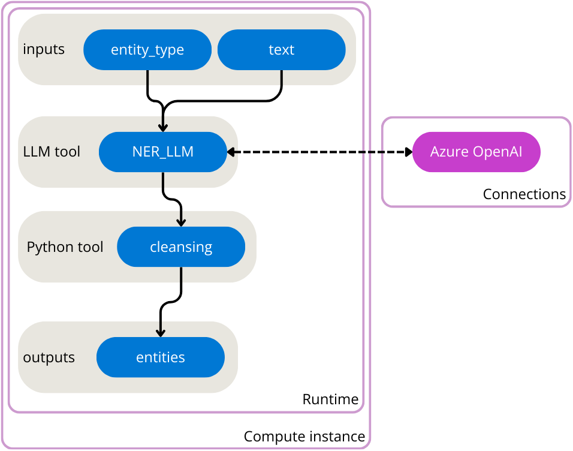

---
lab:
  title: Introdução ao prompt flow no Estúdio de IA do Azure
---

# Introdução ao prompt flow no Estúdio de IA do Azure

A extração de informações valiosas de um texto é conhecida como NER (Reconhecimento de Entidade Nomeada). Entidades são palavras-chave que são de seu interesse em determinado texto.


Os LLMs (modelos de linguagem grande) podem ser usados para executar o NER. Para criar um aplicativo que usa um texto como entidades de entrada e saída, crie um fluxo que usa um nó do LLM com o prompt flow.

Neste exercício, você usará o prompt flow do Estúdio de IA do Azure para criar um aplicativo LLM que espera um tipo de entidade e texto como entrada. Ele chama um modelo GPT do OpenAI do Azure por meio de um nó do LLM para extrair a entidade necessária do texto fornecido, limpa o resultado e gera as entidades extraídas.



Primeiro, você precisa criar um projeto no Estúdio de IA do Azure para criar os recursos necessários do Azure. Em seguida, você pode implantar um modelo GPT com o Serviço OpenAI do Azure. Depois de obter os recursos necessários, você poderá criar o fluxo. Por fim, você vai executar o fluxo para testá-lo e visualizar a saída de exemplo.

## Criar um projeto no Estúdio de IA do Azure

Comece criando um projeto do Estúdio de IA do Azure e um Hub de IA do Azure para dar suporte a ele.

1. Em um navegador da Web, abra [https://ai.azure.com](https://ai.azure.com) e entre usando suas credenciais do Azure.
1. Selecione a página **Criar** e escolha **+ Novo projeto**.
1. No assistente **Criar um projeto**, crie um projeto com as seguintes configurações:
    - **Nome do projeto**: *Um nome exclusivo para seu projeto*
    - **Hub do Azure**: *Crie um recurso com as seguintes configurações:*
        - **Nome do Hub de IA**: *Um nome exclusivo*
        - **Assinatura**: *sua assinatura do Azure*
        - **Grupo de recursos**: *Um novo grupo de recursos*
        - **Localização**: *faça uma escolha **aleatória** de uma das regiões a seguir*\*
        - Leste da Austrália
        - Leste do Canadá
        - Leste dos EUA
        - Leste dos EUA 2
        - França Central
        - Leste do Japão
        - Centro-Norte dos EUA
        - Suécia Central
        - Norte da Suíça
        - Sul do Reino Unido

    > \* Os recursos do OpenAI do Azure são restringidos no nível do locatário por cotas regionais. As regiões listadas incluem a cota padrão para os tipos de modelos usados neste exercício. Escolher aleatoriamente uma região reduz o risco de uma única região atingir o seu limite de cota em cenários em que você está compartilhando um locatário com outros usuários. No caso de um limite de cota ser atingido mais adiante no exercício, há a possibilidade de você precisar criar outro recurso em uma região diferente.

1. Revise a configuração e crie o projeto.
1. Aguarde de 5 a 10 minutos para que o projeto seja criado.

## Implantar um modelo GPT

Para usar um modelo de LLM no prompt flow, primeiro, você precisa implantar um modelo. O Estúdio de IA do Azure permite implantar modelos do OpenAI que você pode usar nos seus fluxos.

1. No painel de navegação à esquerda, em **Componentes**, selecione a página **Implantações**.
1. No Estúdio do OpenAI do Azure, navegue até a página **Implantações**.
1. Crie uma implantação do modelo **gpt-35-turbo** com as seguintes configurações:
    - **Modelo**: `gpt-35-turbo`
    - **Versão do modelo**: *Mantenha o valor padrão*
    - **Nome da implantação**: `gpt-35-turbo`
    - Defina as opções **Avançadas** para usar o filtro de conteúdo padrão e restringir o TPM (tokens por minuto) a **5 mil**.

Agora que você implantou seu modelo de LLM, crie um fluxo no Estúdio de IA do Azure que chama o modelo implantado.

## Criar e executar um fluxo no Estúdio de IA do Azure

Agora que você provisionou todos os recursos necessários, crie um fluxo.

### Criar um novo fluxo

Para criar um fluxo com um modelo, selecione um dos tipos de fluxos que deseja desenvolver.

1. No painel de navegação à esquerda, em **Ferramentas**, selecione **Prompt flow**.
1. Escolha **+ Criar** para criar um fluxo.
1. Crie um **Fluxo padrão** e insira `entity-recognition` como o nome da pasta.

Um fluxo padrão com uma entrada, dois nós e uma saída será criado. Você atualizará o fluxo para receber duas entradas, extrair entidades, limpar a saída do nó do LLM e retornar as entidades como uma saída.

### Iniciar o runtime automático

Para testar o fluxo, você precisa computá-lo. A computação necessária é disponibilizada para você por meio do runtime.

1. Depois que você criar o fluxo nomeado como `entity-recognition`, o fluxo abrirá no estúdio.
1. Escolha o campo **Selecionar runtime** na barra superior.
1. Na lista **Runtime automático**, selecione **Iniciar** para iniciar o runtime automático.
1. Aguarde o runtime ser iniciado.

### Configurar as entradas

O fluxo que você criará terá duas entradas: um texto e o tipo de entidade que você deseja extrair do texto.

1. Em **Entradas**, uma entrada é configurada com o nome `topic` e do tipo `string`. Altere a entrada existente e atualize-a com as seguintes configurações:
    - **Nome**: `entity_type`
    - **Tipo**: `string`
    - **Valor**: `job title`
1. Selecione **Adicionar entrada**.
1. Configure a segunda entrada para que ela tenha as seguintes configurações:
    - **Nome**: `text`
    - **Tipo**: `string`
    - **Valor**: `The software engineer is working on a new update for the application.`

### Configurar o nó do LLM

O fluxo padrão já inclui um nó que usa a ferramenta LLM. Encontre o nó na visão geral do fluxo. O prompt padrão pede uma piada. Você atualizará o nó do LLM para extrair entidades com base nas duas entradas especificadas na seção anterior.

1. Navegue até o **nó do LLM** chamado `joke`.
1. Substitua o nome por `NER_LLM`
1. Em **Conexão**, selecione a conexão `Default_AzureOpenAI`.
1. Em **deployment_name**, escolha o modelo `gpt-35-turbo` implantado.
1. Substitua o campo do prompt pelo seguinte código:

   ```yml
   
   system:

   Your task is to find entities of a certain type from the given text content.
   If there're multiple entities, please return them all with comma separated, e.g. "entity1, entity2, entity3".
   You should only return the entity list, nothing else.
   If there's no such entity, please return "None".

   user:
   
   Entity type: {{entity_type}}
   Text content: {{text}}
   Entities:
   
   ```

1. Selecione **Validar e analisar entrada**.
1. No nó do LLM, na seção **Entradas**, configure o seguinte:
    - Em `entity_type`, selecione o valor `${inputs.entity_type}`.
    - Em `text`, selecione o valor `${inputs.text}`.

O nó do LLM agora usará o tipo de entidade e o texto como entradas, o incluirá no prompt especificado e enviará a solicitação ao modelo implantado.

### Configurar o nó do Python

Para extrair apenas as informações de chave do resultado do modelo, use a ferramenta Python para limpar a saída do nó do LLM.

1. Navegue até o nó do Python chamado `echo`.
1. Substitua o nome por `cleansing`.
1. Substitua o código  pelo seguinte:

   ```python
   from typing import List
   from promptflow import tool
    
    
   @tool
   def cleansing(entities_str: str) -> List[str]:
       # Split, remove leading and trailing spaces/tabs/dots
       parts = entities_str.split(",")
       cleaned_parts = [part.strip(" \t.\"") for part in parts]
       entities = [part for part in cleaned_parts if len(part) > 0]
       return entities
    
   ```

1. Selecione **Validar e analisar entrada**.
1. Dentro do nó do Python, na seção **Entradas**, defina o valor de `entities_str` como `${NER_LLM.output}`.

### Configurar a saída

Por fim, você pode configurar a saída de todo o fluxo. Você deseja apenas uma saída para o fluxo, que devem ser as entidades extraídas.

1. Navegue até as **Saídas** do fluxo.
1. Para **Nome**, insira `entities`.
1. Em **Valor**, selecione `${cleansing.output}`.

### Executar o fluxo

Agora que você desenvolveu o fluxo, execute-o para testá-lo. Como você adicionou valores padrão às entradas, teste o fluxo com facilidade no estúdio.

1. Escolha **Executar** para testar o fluxo.
1. Aguarde até que a execução seja concluída.
1. Selecione **Exibir saídas**. Um pop-up mostrando a saída para as entradas padrão será exibido. Opcionalmente, você também pode inspecionar os logs.

## Excluir recursos do Azure

Quando terminar de explorar o Estúdio de IA do Azure, exclua os recursos criados para evitar custos desnecessários do Azure.

- Navegue até o [portal do Azure](https://portal.azure.com) em `https://portal.azure.com`.
- No portal do Azure, na **Página Inicial**, selecione **Grupos de recursos**.
- Selecione o grupo de recursos criado para este exercício.
- Na parte superior da página de **Visão Geral** do grupo de recursos, selecione **Excluir o grupo de recursos**.
- Digite o nome do grupo de recursos para confirmar que deseja excluí-lo e selecione **Excluir**.
